# Instalación y Prueba de SonarQube

Este documento describe los pasos que seguí para instalar SonarQube y probarlo con una aplicación existente. A continuación, se detallan los pasos:

## 1. Ejecutar Docker Compose para SonarQube

Primero, ejecutamos el `docker-compose` con las instrucciones para ejecutar SonarQube en `localhost:9000`.

```bash
docker-compose up -d
```

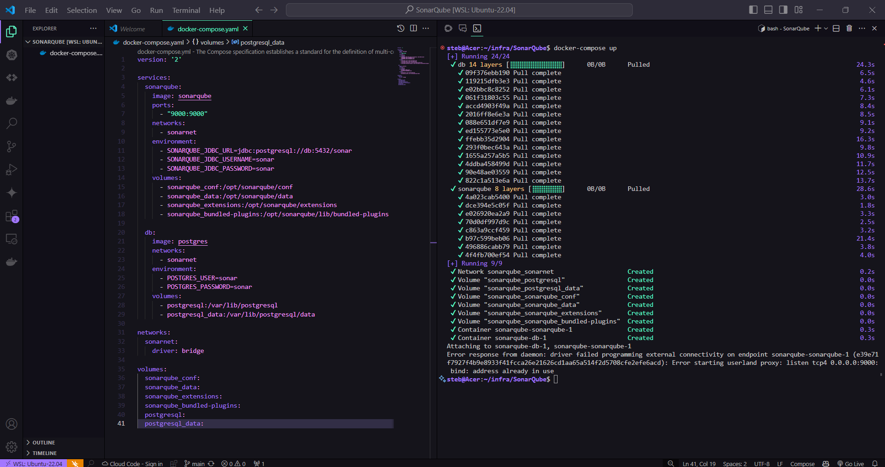

## 2. Iniciar sesión en SonarQube

Abrimos el navegador y navegamos a `localhost:9000`. Iniciamos sesión con las credenciales por defecto:
- **Usuario:** admin
- **Contraseña:** admin

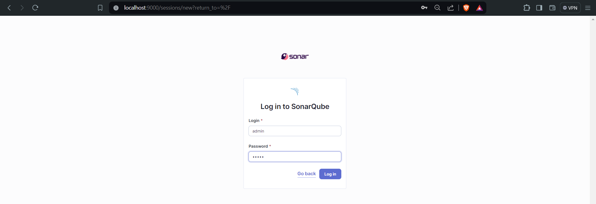

Luego, cambiamos la contraseña por una nueva.

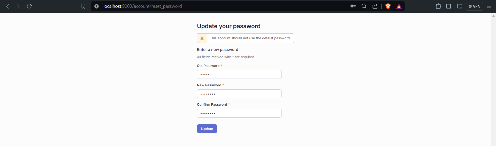

## 3. Crear un Proyecto Local

Creamos un nuevo proyecto local, le damos un nombre y guardamos el ID del proyecto. 

1. Damos clic en "Create new project".
2. Ingresamos el nombre del proyecto y guardamos el ID.

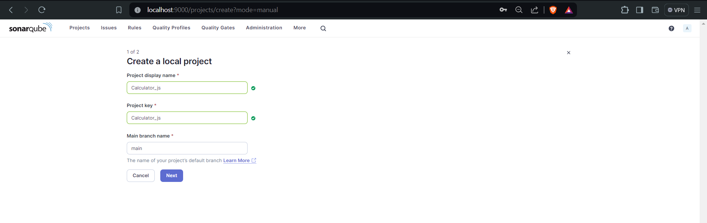

## 4. Configurar Análisis Local


Seleccionamos la opción "Use global settings" para que el análisis se realice en local.

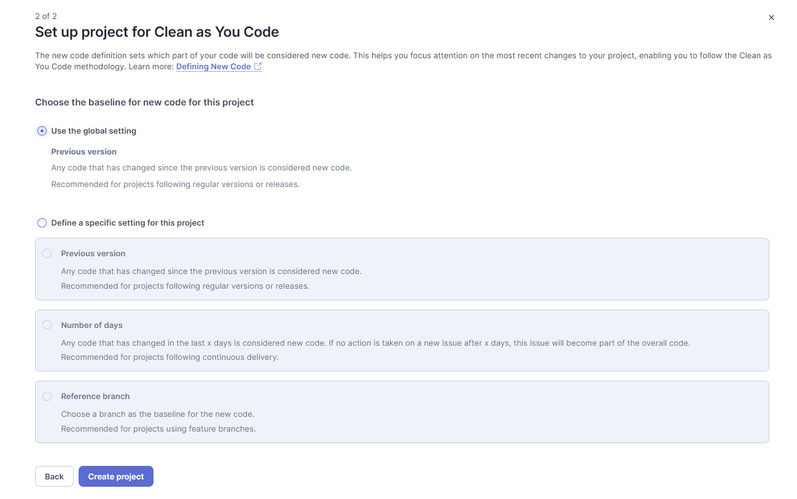

Dar click en Locally

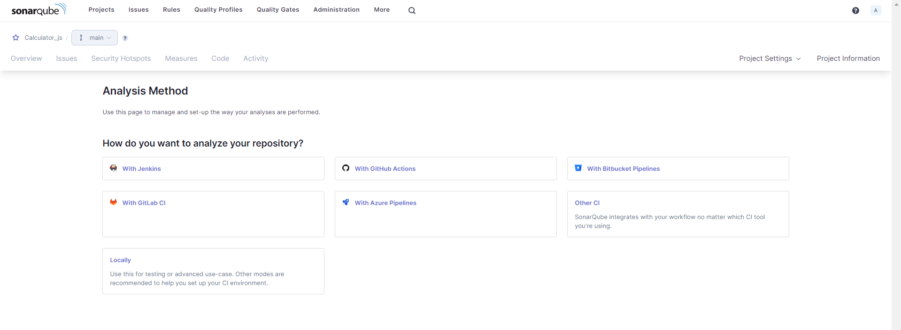

Generamos el Token:

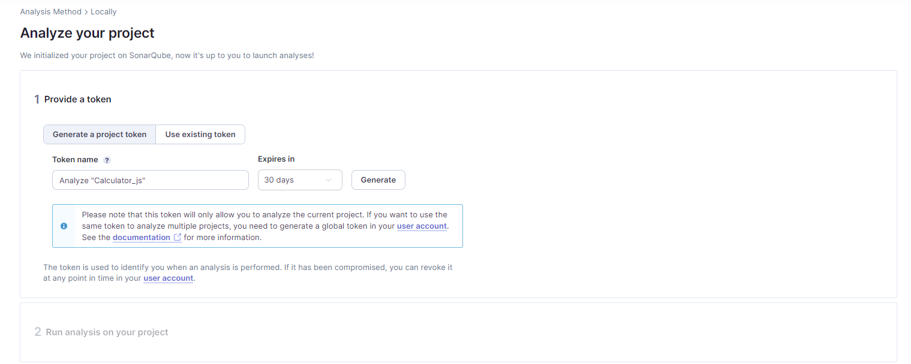

## 6. Instalación de Dependencias

Instalamos las siguientes dependencias necesarias:

```bash
sudo apt install wget
sudo apt install unzip
```

## 7. Descargar y Configurar Sonar Scanner

Descargamos Sonar Scanner y lo configuramos en el sistema.

```bash
wget https://binaries.sonarsource.com/Distribution/sonar-scanner-cli/sonar-scanner-cli-5.0.1.3006-linux.zip
unzip sonar-scanner-cli-5.0.1.3006-linux.zip
sudo mv sonar-scanner-5.0.1.3006-linux /opt/sonar-scanner
```

Agregamos Sonar Scanner al PATH:

```bash
sudo ln -s /opt/sonar-scanner/bin/sonar-scanner /usr/local/bin/sonar-scanner
echo 'export PATH="/opt/sonar-scanner/bin:$PATH"' >> ~/.bashrc
source ~/.bashrc
```

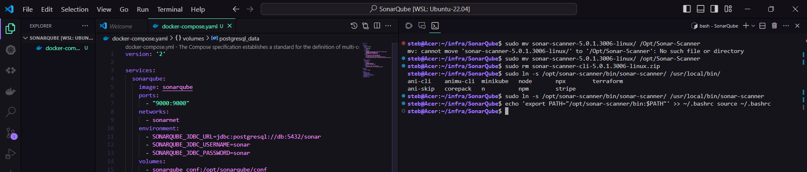

## 8. Ejecutar el Análisis con Sonar Scanner

Copiamos los comandos proporcionados por SonarQube en la página del proyecto y ejecutamos el análisis.

```bash
sonar-scanner \
  -Dsonar.projectKey=nombre-del-proyecto \
  -Dsonar.sources=. \
  -Dsonar.host.url=http://localhost:9000 \
  -Dsonar.login=tu-token-generado
```

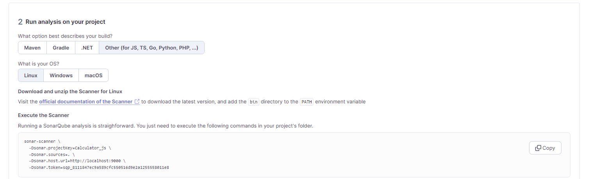

## 9. Verificar los Resultados del Análisis

Esperamos a que el análisis se complete y verificamos los resultados en la página de SonarQube.

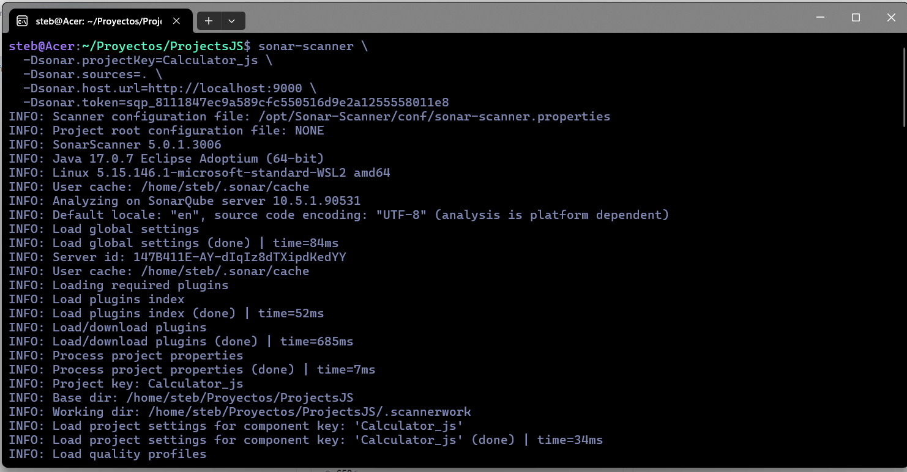
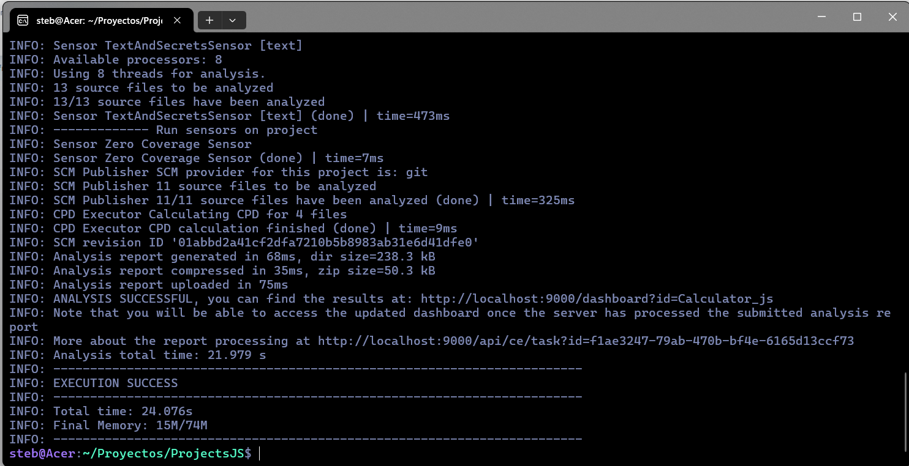

## Comprobaciones

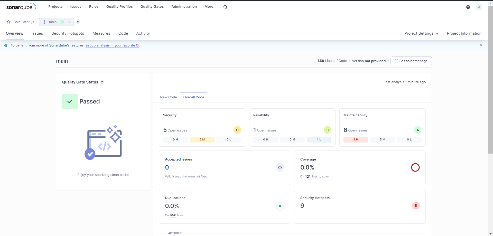


## Conclusión

Siguiendo estos pasos, hemos instalado y configurado SonarQube, y hemos realizado un análisis estático de código en una aplicación existente. Los resultados del análisis se pueden verificar en la interfaz web de SonarQube.

